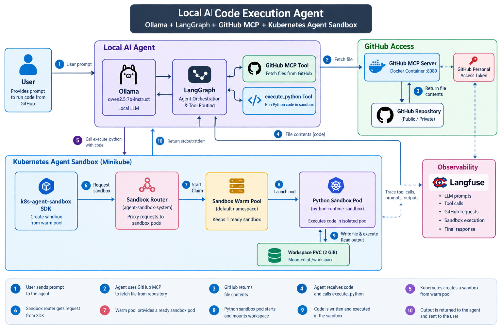
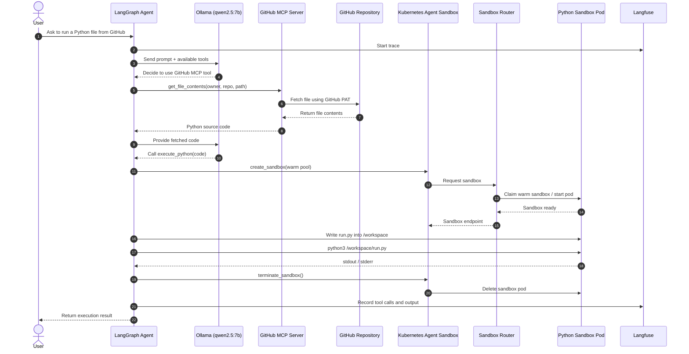
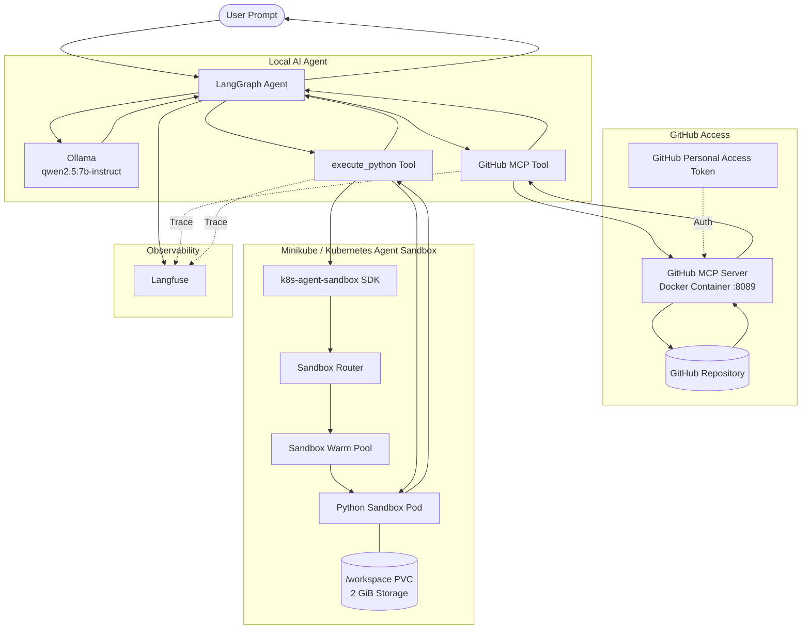
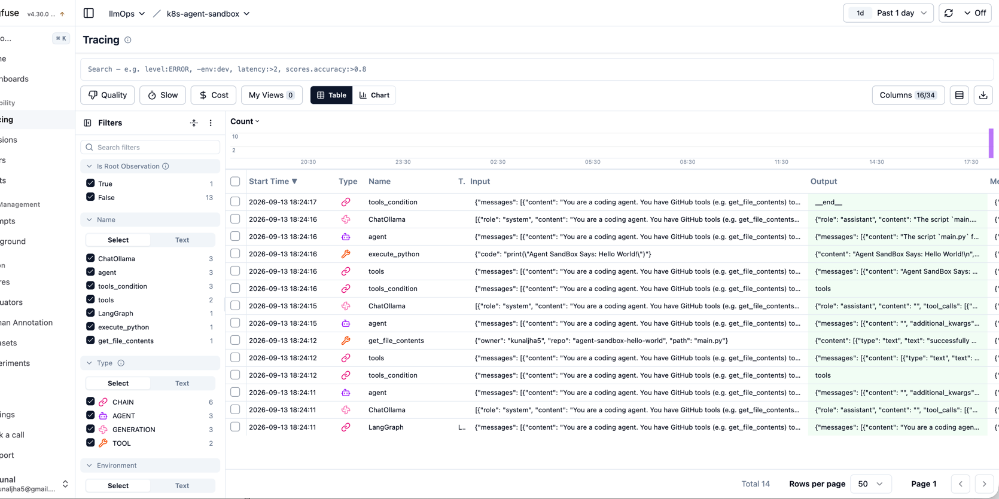

# Build a Local AI Coding Agent with Ollama, GitHub MCP, and Kubernetes Sandbox

A step-by-step guide to build a local AI agent that can read GitHub repositories and safely execute Python code inside Kubernetes.

---

## Why I Built This

I wanted an AI coding agent that could:

- Run locally.
- Read code from GitHub.
- Execute code safely.
- Keep my laptop isolated from generated code.
- Trace every tool call.

The result is a local AI agent powered by Kubernetes.




---

## What We Are Building

```text
Prompt
  │
  ▼
Ollama
  │
  ▼
LangGraph Agent
  │
  ├── GitHub MCP
  └── Kubernetes Sandbox
```

The LLM never runs code on your laptop.

Instead, it creates a temporary Python sandbox inside Kubernetes.

---

## Sequence 



---

## Architecture Overview



---

## Step 1 - Start Minikube

```bash
minikube start
```

Check the cluster.

```bash
kubectl get nodes
```

---

## Step 2 - Install Kubernetes Agent Sandbox

Install the controller.

```bash
VERSION=$(curl -s https://api.github.com/repos/kubernetes-sigs/agent-sandbox/releases/latest | jq -r '.tag_name')
kubectl apply -f https://github.com/kubernetes-sigs/agent-sandbox/releases/download/${VERSION}/sandbox-with-extensions.yaml
kubectl -n agent-sandbox-system wait --for=condition=Ready pod -l app=agent-sandbox-controller --timeout=120s

```

The controller creates the custom Kubernetes resources needed for sandboxes.


---

## Step 3 - Deploy the Sandbox Router

The Python SDK communicates through the router. For local development enable unauthenticated access.

```bash
curl -sSL https://raw.githubusercontent.com/kubernetes-sigs/agent-sandbox/refs/tags/${VERSION}/clients/python/agentic-sandbox-client/sandbox-router/sandbox_router.yaml \
  | sed 's|${ROUTER_IMAGE}|us-central1-docker.pkg.dev/k8s-staging-images/agent-sandbox/sandbox-router:latest-main|g' > sandbox_router.yaml

kubectl apply -n agent-sandbox-system -f sandbox_router.yaml
kubectl set env deployment/sandbox-router-deployment -n agent-sandbox-system ALLOW_UNAUTHENTICATED_ROUTER=true
kubectl rollout status deployment/sandbox-router-deployment -n agent-sandbox-system --timeout=60s
```


---

## Step 4 - Create a Sandbox Template

A template defines the sandbox pod.

Example configuration:

- Python runtime image.
- 2 GiB workspace volume.
- CPU and memory limits.
- `/workspace` mounted for code execution.

Apply it.

```bash
kubectl apply -f sandbox-template.yaml
```

---

## Step 5 - Create a Warm Pool

```bash
kubectl apply -f sandbox-warmpool.yaml

kubectl get sandboxwarmpools
kubectl get sandboxes -A
kubectl get pvc
```

A warm pool keeps one sandbox ready so execution starts quickly.

---

## Step 6 - Run GitHub MCP Server

Start MCP with Docker.

```bash
export GITHUB_PERSONAL_ACCESS_TOKEN=ghp_xxxxxxxx
ocker run -d --name github-mcp -p 8089:8089 \
  -e GITHUB_PERSONAL_ACCESS_TOKEN=$GITHUB_PERSONAL_ACCESS_TOKEN \
  ghcr.io/github/github-mcp-server http --port 8089
```

Check that it is running.

```bash
docker ps
```

---

## Step 7 - Configure Environment Variables

```bash
```

Optional Langfuse configuration.

```bash
export LANGFUSE_PUBLIC_KEY=<key>
export LANGFUSE_SECRET_KEY=<key>
export LANGFUSE_HOST=http://localhost:3000
export GITHUB_PERSONAL_ACCESS_TOKEN=<token>

```

---

## Step 8 - Install Python Packages

```bash
pip install \
langgraph \
langchain-core \
langchain-ollama \
langchain-mcp-adapters \
langfuse \
k8s-agent-sandbox
```

---

## Step 9 - Run the Agent

```bash
python sandbox-git-clone-repo-and-execute.py
```

Example prompt:

> Fetch `main.py` from `kunaljha5/agent-sandbox-hello-world` and run it.

The agent fetches the file through GitHub MCP and executes it inside Kubernetes.

---

# How Each Module Helps

| Module                   | What it does                                                |
|--------------------------|-------------------------------------------------------------|
| `langgraph`              | Controls the agent workflow and tool routing.               |
| `langchain-core`         | Creates tools and messages for the LLM.                     |
| `langchain-ollama`       | Connects LangChain to Ollama.                               |
| `langchain-mcp-adapters` | Connects LangGraph tools to MCP servers.                    |
| `k8s-agent-sandbox`      | Creates and manages sandbox pods in Kubernetes.             |
| `langfuse`               | Records prompts, tool calls, outputs, and execution traces. |
| `asyncio`                | Runs asynchronous MCP and LangGraph calls.                  |
| `base64`                 | Safely writes generated code into the sandbox workspace.    |
| `os`                     | Reads environment variables like GitHub tokens.             |

---

# Agent Flow

1. User sends a prompt.
2. Ollama decides whether GitHub access is needed.
3. GitHub MCP fetches the requested file.
4. LangGraph passes the file contents to `execute_python`.
5. Kubernetes creates a sandbox.
6. Python runs inside `/workspace`.
7. Output returns to the LLM.
8. Langfuse stores the trace.

---

# Why Use Kubernetes Sandbox?

- Every execution is isolated.
- No code runs directly on the host.
- Fresh environment for every request.
- Workspace is attached through a PVC.
- Easy to scale with warm pools.

---

## Langfuse Trace

This is a sample trace showing the LLM prompt, GitHub MCP tool call, sandbox execution, and final response.



